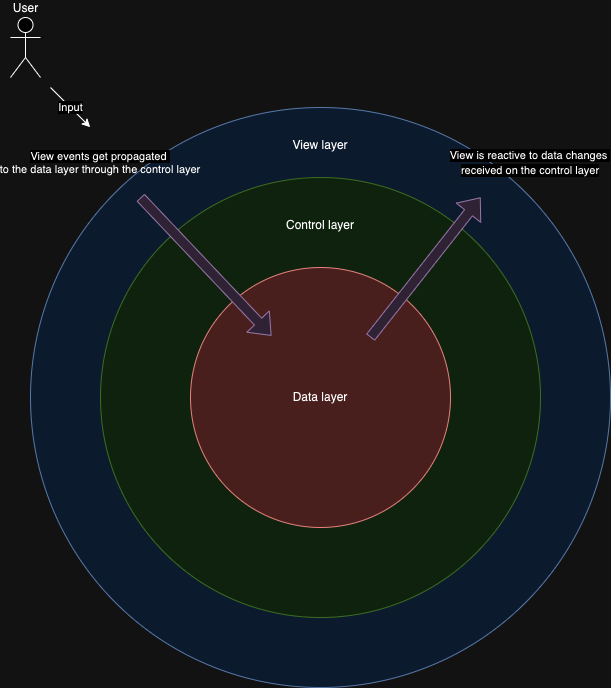
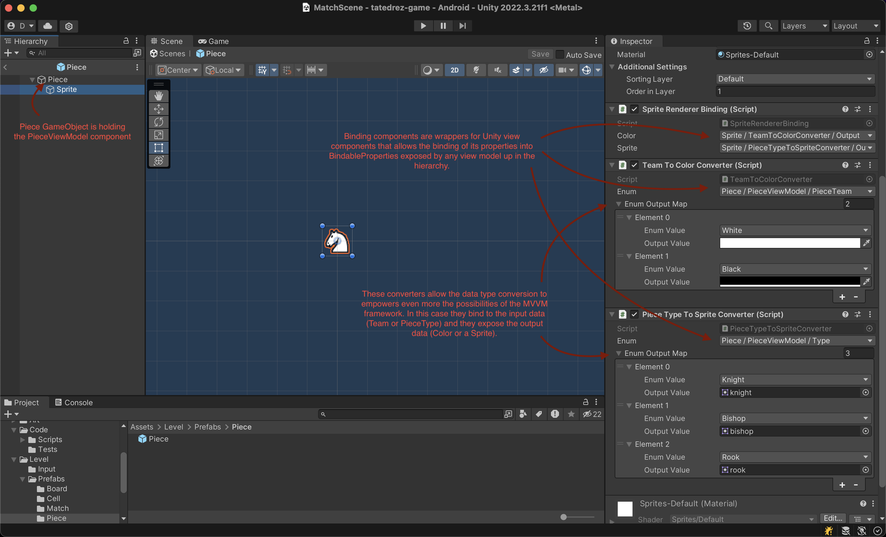

# Game architecture

It's a layer-based architecture, with three main layers.

The **data layer**, containing Models (runtime data) & Configs (static data configurable in Editor).
This layer holds the game data and modifies it. 

The **control layer**, containing ViewModels (glue between the data & view layers) and any other logic components.
This layer serves as a bridge between the data & view layers, taking the responsibility of modifying the data layer when events are received from the view layer (such as input).

The **view layer**, containing any Unity components exposed in the Scene. This layer receives the input, and using Bindings/Bindables notifies the control layer (view models).

# Architecture purpose

This is a powerful architecture that keeps completely decoupled the data from the view layer, allowing you to hold a complete state of the game in the data layer, really useful for unit testing (which only need to inject custom models) or serialization (saving the game state). The game structure becomes really simple with this architecture, since extending any of the layers can be done in parallel without making different teams dependant on each other's work. Also, this architecture greatly benefits from the SOLID principles, since having single responsibility and segreagated interfaces allows you to inject models into the control layer in a safe way, always keeping the responsibilities of each class clearly defined.

# The power of MVVM

I chose the MVVM (Model-View-ViewModel) pattern because of how powerful it behaves when used with a layered architecture with decoupled responsibilities. The MVVM framework I created allows the view to bind its properties to the exposed BindableProperties of the ViewModels, acting in a reactive way to changes in the data layer. This is a great pattern that empowers the technical and UI artists, making everyone life easier since UI iteration and extension becomes a work completely developed on Editor with minimal code support required.

# Implementation details

The game counts with three main entities:

The **Match**, holding the board and keeping track of the match state & winning condition.

The **Board**, holding the state of each cell and the pieces. Is the one having the big picture of the cells, therefore the one in charge of verifying the validity of the movements.
It performs all the piece related logic helped by the **PiecesHandler** logic component.

The **Piece**s, mainly responsibles of their movement pattern.